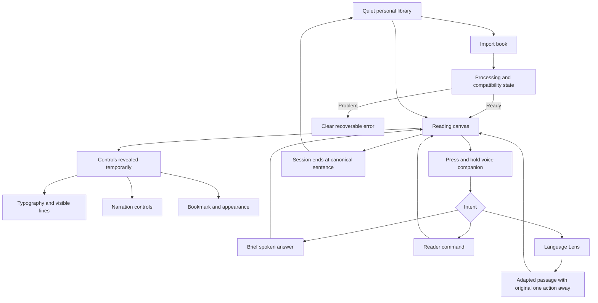

# Voltaire visual product map

This map describes product surfaces, not a final visual design. Rendered iPad mockups must be approved separately before M1 implementation.

## What is normally visible

- The book text.
- A very small reading-position indicator if enabled.
- A quiet companion affordance if enabled.

## What appears only on request

- Reader controls.
- Typography and line-count settings.
- Narration controls.
- Spoken-answer transcript.
- Adapted Language Lens passage.
- Original/adapted comparison.
- Book information and processing detail.

## What does not exist in the personal MVP

- Home feed.
- Storefront.
- Social activity.
- Reading streak dashboard.
- Permanent AI chat screen.
- Subscription or account surface.
- Public profile.
